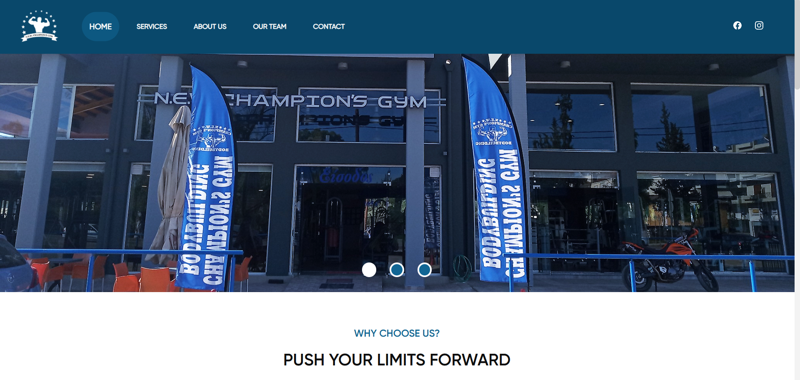
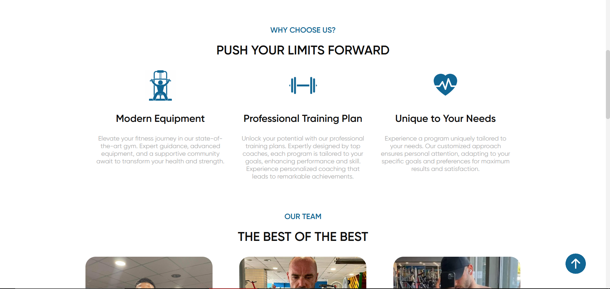
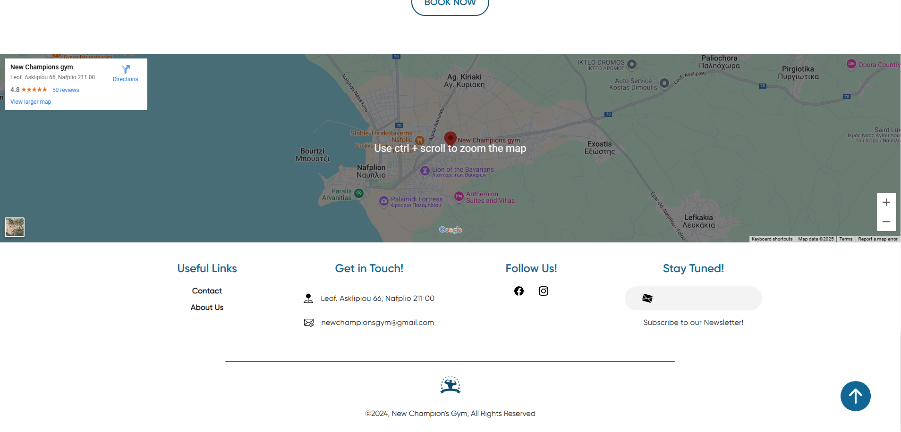
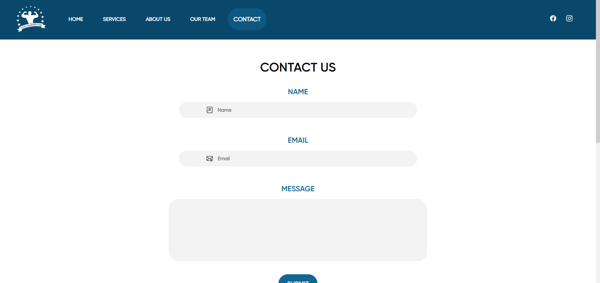

# 🌐 Gym Website

This practice project showcases my frontend development skills through a **fully responsive website** designed for a local gym. Focusing primarily on **user interface design** and **user experience** principles, the site presents a modern digital presence for a fitness center.

---

## 🛠️ Technologies Used

- **HTML5, CSS3, JavaScript**
- **Bootstrap 5** for responsive UI
- **VS Code** (development IDE)

---

## 📄 License

This project is open-source.

---

## 🤝 Contributing

Pull requests are welcome! Please follow standard GitHub flow and keep the code clean and documented.

---

## 📬 Contact

For questions, contact me at [obrizanou@gmail.com](mailto:obrizanou@gmail.com) or open an issue.
