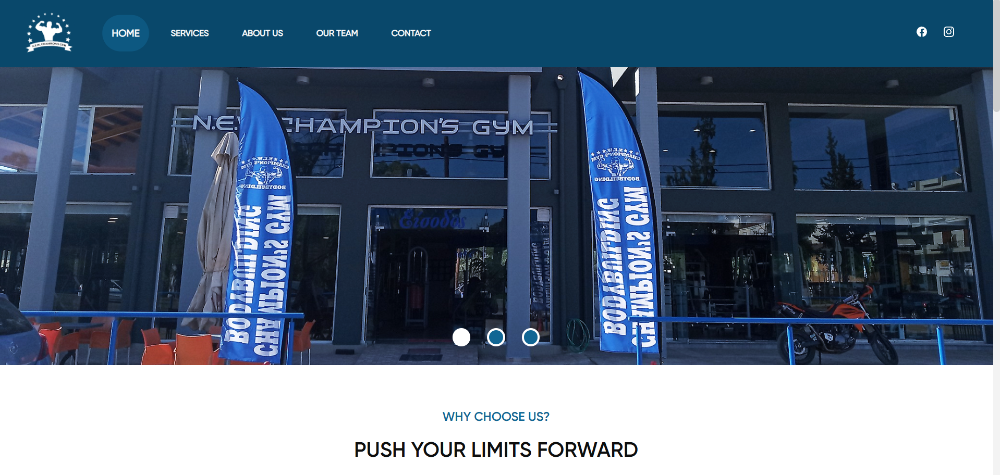
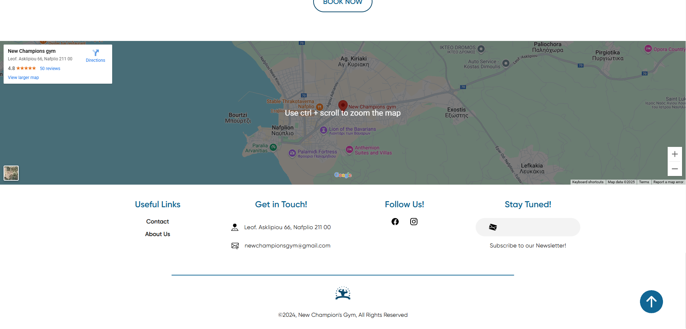
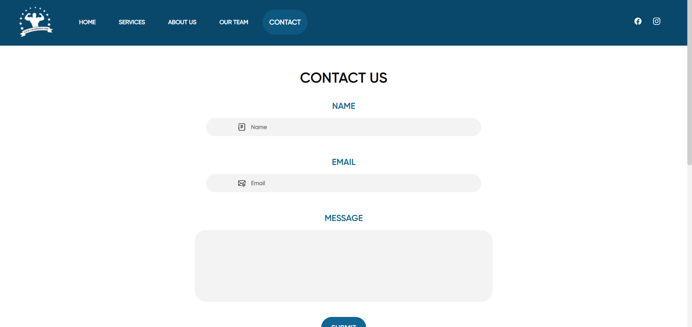

# Gym Website Landing Page

[](https://gym-website-new-champions.netlify.app/)
[](https://opensource.org/licenses/MIT)

A modern, fully responsive landing page designed for a local fitness center. This project emphasizes clean UI/UX design, mobile-first responsiveness, and optimized performance to create a professional digital presence for a brick-and-mortar business.



## ✨ Core Features

*   **Responsive Web Design:** Fully fluid layout that adapts seamlessly to desktops, tablets, and smartphones using Bootstrap 5.
*   **Modern UI Components:** Features a clean, high-contrast aesthetic typical of contemporary fitness marketing.
*   **Performance Optimized:** Focused on fast load times and accessible navigation structure.
*   **Professional Layout:** Includes essential business sections such as hero banners, service showcases, and contact information.

## 🛠️ Built With

<p align="left">
  
  
  
  
</p>




## 🚀 Getting Started

To view the site locally:

1. **Clone the repository:**
```bash
   git clone [https://github.com/filipposobrijanu/Gym-Website.git](https://github.com/filipposobrijanu/Gym-Website.git)
